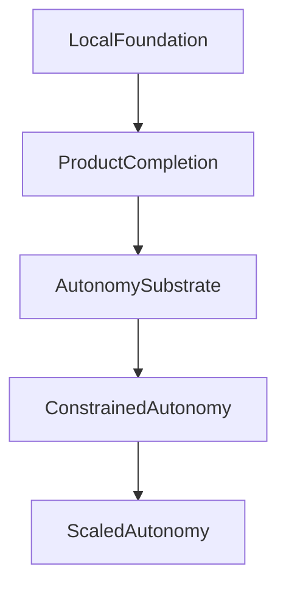

# P11 Platform And Autonomy Roadmap

## Goal

Make the platform locally reliable and product-complete before expanding autonomous behavior, then graduate from assistive automation to constrained autonomy with measurable KPI and policy gates.

## Strategic Thesis

The project is not a generic AI application. It is a vertically integrated operating system for multifamily marketing and leasing.

That means the implementation order matters:

1. trustworthy property and business context
2. trustworthy product execution surfaces
3. a shared substrate for jobs, actions, approvals, policy, and outcomes
4. only then recommendation-first autonomy and later cross-product orchestration

The long-term opportunity is strong precisely because the platform can unify:

- property truth
- brand truth
- knowledge truth
- external execution
- human decision history
- outcome evidence

The near-term risk is also clear: if breadth outruns trust or the autonomy narrative outruns the substrate, the project will accumulate impressive-looking surfaces without a dependable control plane underneath them.

## Guiding Rule

No new autonomous write-path should advance until the underlying product surface is stable, observable, test-gated, reversible, and locally reproducible.

When human supervision is required, it must be real supervision: reviewers need to be able to approve, deny, or modify proposed actions and leave preserved textual reasoning that becomes part of the durable decision history.

## Local-First Rule

This roadmap is now optimized for local progression through P3.

- GitHub Actions enforcement is deferred.
- Vercel deployment enforcement is deferred.
- Hosted staging, uptime alerting, and backup/PITR drills are deferred.
- Local quality gates, local service orchestration, local smoke/e2e validation, and local reliability testing are required.

## Relationship To Older Prod Planning

Use this roadmap as the source of truth for current priority.

- Older production-readiness planning is still useful, but it should be read as deferred hosted-ops guidance unless it directly helps finish the remaining local `P0` items.
- Sentry, hosted monitoring, staging, PITR, CI enforcement, and environment cutover work are not current `P0` blockers.
- ETL/data-engine alignment is not abandoned, but it is only part of current `P0` if it blocks local smoke/e2e, cron visibility, or failure-injection work.
- Repository automation exists for scheduled pipeline execution, but app-quality PR/push enforcement for web gates is still deferred.

See [`outdateddocs/P0_LOCAL_CONTINUATION_CONTEXT.md`](outdateddocs/P0_LOCAL_CONTINUATION_CONTEXT.md) for the canonical explanation of that boundary.

## Current Status Snapshot

Completed now:

- Web test infrastructure exists in [`p11-platform/apps/web/package.json`](p11-platform/apps/web/package.json) with Vitest and `check:foundation`.
- Curated foundation gate exists in [`p11-platform/apps/web/scripts/foundation-files.mjs`](p11-platform/apps/web/scripts/foundation-files.mjs).
- `/api/health` exists in [`p11-platform/apps/web/app/api/health/route.ts`](p11-platform/apps/web/app/api/health/route.ts) backed by [`p11-platform/apps/web/utils/health.ts`](p11-platform/apps/web/utils/health.ts).
- Request IDs and structured request logging exist in [`p11-platform/apps/web/utils/services/request-context.ts`](p11-platform/apps/web/utils/services/request-context.ts).
- Centralized tenant-safe property auth checks exist in [`p11-platform/apps/web/utils/services/auth-guard.ts`](p11-platform/apps/web/utils/services/auth-guard.ts).
- Shared tenant-safe auth utilities exist, but route adoption is not yet standardized through a single wrapper/HOF; new authenticated property-scoped work should prefer shared enforcement over repeating inline auth/property checks.
- Critical API clusters have been hardened and covered with route tests, including cron, leads, lumaleasing, propertyaudit, reviewflow, reports, onboarding, workflows, integrations, conversations, brandforge, documents, properties, audit, chat, search, mcp, siteforge, and marketvision.
- A documented one-command local startup flow now exists via [`p11-platform/package.json`](p11-platform/package.json) and [`p11-platform/scripts/local-dev.sh`](p11-platform/scripts/local-dev.sh).
- Local Supabase bootstrap, reset, and deterministic fixtures now exist via [`p11-platform/supabase/config.toml`](p11-platform/supabase/config.toml), [`p11-platform/supabase/seed.sql`](p11-platform/supabase/seed.sql), and [`p11-platform/scripts/write-local-supabase-env.mjs`](p11-platform/scripts/write-local-supabase-env.mjs).
- Local smoke/e2e coverage now exists via [`p11-platform/apps/web/playwright.config.ts`](p11-platform/apps/web/playwright.config.ts), [`p11-platform/apps/web/e2e/local-smoke.spec.ts`](p11-platform/apps/web/e2e/local-smoke.spec.ts), and [`p11-platform/package.json`](p11-platform/package.json).
- Cron/job visibility now exists via [`p11-platform/supabase/migrations/20260313011500_add_cron_job_runs.sql`](p11-platform/supabase/migrations/20260313011500_add_cron_job_runs.sql), [`p11-platform/apps/web/utils/services/cron-job-runs.ts`](p11-platform/apps/web/utils/services/cron-job-runs.ts), and [`p11-platform/apps/web/app/api/cron/runs/route.ts`](p11-platform/apps/web/app/api/cron/runs/route.ts).
- Critical public-route validation and rate limiting now cover the main anonymous LumaLeasing surfaces for local and single-instance operation via [`p11-platform/apps/web/utils/services/validation.ts`](p11-platform/apps/web/utils/services/validation.ts), [`p11-platform/apps/web/utils/services/rate-limiter.ts`](p11-platform/apps/web/utils/services/rate-limiter.ts), and the hardened widget routes in `app/api/lumaleasing/*`; a hosted/serverless-safe replacement is still deferred.
- `SiteForge` deployment path is materially implemented in [`p11-platform/apps/web/utils/siteforge/wordpress-client.ts`](p11-platform/apps/web/utils/siteforge/wordpress-client.ts): Cloudways provisioning, credential fallback/rotation, WordPress media upload + media ID injection, readiness checks, and post-deploy verification.
- `SiteForge` deployment diagnostics are now persisted into `property_websites.generation_input.deploymentDiagnostics` by [`p11-platform/apps/web/app/api/siteforge/deploy/[websiteId]/route.ts`](p11-platform/apps/web/app/api/siteforge/deploy/[websiteId]/route.ts), and surfaced via [`p11-platform/apps/web/app/api/siteforge/status/[websiteId]/route.ts`](p11-platform/apps/web/app/api/siteforge/status/[websiteId]/route.ts) and [`p11-platform/apps/web/app/api/siteforge/preview/[websiteId]/route.ts`](p11-platform/apps/web/app/api/siteforge/preview/[websiteId]/route.ts).
- `SiteForge` dashboard preview now shows deployment diagnostics and retry guidance in [`p11-platform/apps/web/components/siteforge/WebsitePreview.tsx`](p11-platform/apps/web/components/siteforge/WebsitePreview.tsx).
- Focused tests now cover this slice in [`p11-platform/apps/web/utils/siteforge/wordpress-client.test.ts`](p11-platform/apps/web/utils/siteforge/wordpress-client.test.ts), [`p11-platform/apps/web/app/api/siteforge/deploy/[websiteId]/route.test.ts`](p11-platform/apps/web/app/api/siteforge/deploy/[websiteId]/route.test.ts), [`p11-platform/apps/web/app/api/siteforge/status/[websiteId]/route.test.ts`](p11-platform/apps/web/app/api/siteforge/status/[websiteId]/route.test.ts), and [`p11-platform/apps/web/app/api/siteforge/preview/[websiteId]/route.test.ts`](p11-platform/apps/web/app/api/siteforge/preview/[websiteId]/route.test.ts).
- `SiteForge` now has a deterministic local generate+deploy+rollback smoke check in [`p11-platform/apps/web/e2e/local-smoke.spec.ts`](p11-platform/apps/web/e2e/local-smoke.spec.ts) that verifies `generate (?simulate=1) -> deploy (?simulate=1) -> rollback preflight -> rollback execute -> ready_for_preview`.
- `SiteForge` now has an opt-in real-target smoke path in [`p11-platform/apps/web/e2e/local-smoke.spec.ts`](p11-platform/apps/web/e2e/local-smoke.spec.ts) gated by `SITEFORGE_REAL_DEPLOY_SMOKE=1` to validate deploy (non-simulated) + rollback against Cloudways or an existing WordPress target.
- `SiteForge` real-target smoke was re-run in local operator mode with Cloudways credentials and local-seeded auth; the run enters real deploy state and keeps polling `status`, but does not reach a terminal deploy/rollback result within the validation window, so this checklist remains open pending provider-side completion diagnostics.
- `SiteForge` deploy hardening now enforces request-level Cloudways/WordPress timeouts plus a deployment-level timeout and step-level progress updates in [`p11-platform/apps/web/utils/siteforge/wordpress-client.ts`](p11-platform/apps/web/utils/siteforge/wordpress-client.ts) and [`p11-platform/apps/web/app/api/siteforge/deploy/[websiteId]/route.ts`](p11-platform/apps/web/app/api/siteforge/deploy/[websiteId]/route.ts), preventing indefinitely stuck `deploying` states from hanging without terminal diagnostics.
- `SiteForge` route hardening now uses service-client DB access (with existing auth/property checks preserved) in [`p11-platform/apps/web/app/api/siteforge/generate/route.ts`](p11-platform/apps/web/app/api/siteforge/generate/route.ts), [`p11-platform/apps/web/app/api/siteforge/rollback/[websiteId]/route.ts`](p11-platform/apps/web/app/api/siteforge/rollback/[websiteId]/route.ts), and [`p11-platform/apps/web/app/api/siteforge/status/[websiteId]/route.ts`](p11-platform/apps/web/app/api/siteforge/status/[websiteId]/route.ts) to avoid local RLS false-`404` failures.
- `LumaLeasing` now prevents duplicate bookings and duplicate Gmail outbound sends across retries in [`p11-platform/apps/web/app/api/lumaleasing/tours/route.ts`](p11-platform/apps/web/app/api/lumaleasing/tours/route.ts) and [`p11-platform/apps/web/app/api/lumaleasing/email/send/route.ts`](p11-platform/apps/web/app/api/lumaleasing/email/send/route.ts), with route coverage in [`p11-platform/apps/web/app/api/lumaleasing/tours/route.test.ts`](p11-platform/apps/web/app/api/lumaleasing/tours/route.test.ts) and [`p11-platform/apps/web/app/api/lumaleasing/email/send/route.test.ts`](p11-platform/apps/web/app/api/lumaleasing/email/send/route.test.ts).
- `LumaLeasing` inbound Gmail ingestion now records `email_received` lifecycle activity entries for matched leads in [`p11-platform/apps/web/utils/services/gmail-service.ts`](p11-platform/apps/web/utils/services/gmail-service.ts), with coverage in [`p11-platform/apps/web/utils/services/gmail-service.test.ts`](p11-platform/apps/web/utils/services/gmail-service.test.ts).
- `LumaLeasing` Gmail webhook ingestion now passes the Pub/Sub `historyId` as an incremental sync hint and skips stale/duplicate `historyId` notifications before sync, reducing unnecessary full inbox scans and retry reprocessing in [`p11-platform/apps/web/app/api/lumaleasing/email/webhook/route.ts`](p11-platform/apps/web/app/api/lumaleasing/email/webhook/route.ts) and [`p11-platform/apps/web/utils/services/gmail-service.ts`](p11-platform/apps/web/utils/services/gmail-service.ts).
- `LumaLeasing` email threads now move through deterministic reply states during send/ingest (`awaiting_lead_reply` after outbound send, `awaiting_internal_reply` after inbound ingest) in [`p11-platform/apps/web/app/api/lumaleasing/email/send/route.ts`](p11-platform/apps/web/app/api/lumaleasing/email/send/route.ts) and [`p11-platform/apps/web/utils/services/gmail-service.ts`](p11-platform/apps/web/utils/services/gmail-service.ts), with targeted coverage in [`p11-platform/apps/web/app/api/lumaleasing/email/send/route.test.ts`](p11-platform/apps/web/app/api/lumaleasing/email/send/route.test.ts) and [`p11-platform/apps/web/utils/services/gmail-service.test.ts`](p11-platform/apps/web/utils/services/gmail-service.test.ts).
- `LumaLeasing` operator visibility now includes Gmail thread lifecycle counters in [`p11-platform/apps/web/app/api/lumaleasing/email/status/route.ts`](p11-platform/apps/web/app/api/lumaleasing/email/status/route.ts), and the dashboard config now surfaces Gmail connection + pending reply counts in [`p11-platform/apps/web/components/lumaleasing/LumaLeasingConfig.tsx`](p11-platform/apps/web/components/lumaleasing/LumaLeasingConfig.tsx).
- `LumaLeasing` now supports deterministic thread completion via [`p11-platform/apps/web/app/api/lumaleasing/email/threads/[threadId]/status/route.ts`](p11-platform/apps/web/app/api/lumaleasing/email/threads/[threadId]/status/route.ts), including idempotent no-op updates and lead activity logging for status changes, with coverage in [`p11-platform/apps/web/app/api/lumaleasing/email/threads/[threadId]/status/route.test.ts`](p11-platform/apps/web/app/api/lumaleasing/email/threads/[threadId]/status/route.test.ts).
- `LumaLeasing` status visibility now includes a pending-thread preview list, and the dashboard config can resolve threads inline via the new status endpoint, improving operator completion flow for reply lifecycle follow-up.
- `LumaLeasing` outbound send now supports deterministic completion intent (`markThreadResolved`) including duplicate-retry-safe thread resolution without re-sending in [`p11-platform/apps/web/app/api/lumaleasing/email/send/route.ts`](p11-platform/apps/web/app/api/lumaleasing/email/send/route.ts), with coverage in [`p11-platform/apps/web/app/api/lumaleasing/email/send/route.test.ts`](p11-platform/apps/web/app/api/lumaleasing/email/send/route.test.ts).
- `LumaLeasing` admin config now propagates tour duration, buffer, business hours, and timezone updates into connected calendar settings (`agent_calendars`) so availability and booking event timing stay aligned with operator changes in [`p11-platform/apps/web/app/api/lumaleasing/admin/config/route.ts`](p11-platform/apps/web/app/api/lumaleasing/admin/config/route.ts), with coverage in [`p11-platform/apps/web/app/api/lumaleasing/admin/config/route.test.ts`](p11-platform/apps/web/app/api/lumaleasing/admin/config/route.test.ts).
- `LumaLeasing` booking lifecycle update/cancel paths now support `tour_bookings` (not just legacy `tours`) in [`p11-platform/apps/web/app/api/leads/[id]/tours/route.ts`](p11-platform/apps/web/app/api/leads/[id]/tours/route.ts), including calendar event resync/cancel attempts plus retry-safe failure logging for operator follow-up.
- `LumaLeasing` calendar status now surfaces sync health telemetry (synced vs failed events, missing-event active bookings, degraded flag) in [`p11-platform/apps/web/app/api/lumaleasing/calendar/status/route.ts`](p11-platform/apps/web/app/api/lumaleasing/calendar/status/route.ts) and the dashboard tours UI in [`p11-platform/apps/web/components/lumaleasing/LumaLeasingConfig.tsx`](p11-platform/apps/web/components/lumaleasing/LumaLeasingConfig.tsx).
- `LumaLeasing` now has a property-scoped calendar reconciliation path in [`p11-platform/apps/web/app/api/lumaleasing/calendar/reconcile/route.ts`](p11-platform/apps/web/app/api/lumaleasing/calendar/reconcile/route.ts) plus an operator repair action in [`p11-platform/apps/web/components/lumaleasing/LumaLeasingConfig.tsx`](p11-platform/apps/web/components/lumaleasing/LumaLeasingConfig.tsx) to recreate or repair missing/failed Google Calendar sync rows for active bookings.
- `LumaLeasing` calendar reconciliation logic is now shared in [`p11-platform/apps/web/utils/services/lumaleasing-calendar-reconcile.ts`](p11-platform/apps/web/utils/services/lumaleasing-calendar-reconcile.ts) and exposed through [`p11-platform/apps/web/app/api/cron/calendar-reconcile/route.ts`](p11-platform/apps/web/app/api/cron/calendar-reconcile/route.ts), giving the platform an automatic repair path for healthy calendar configs instead of relying only on manual operator intervention.
- `LumaLeasing` now ingests provider-side Google Calendar mutations through [`p11-platform/apps/web/utils/services/lumaleasing-calendar-mutations.ts`](p11-platform/apps/web/utils/services/lumaleasing-calendar-mutations.ts) and [`p11-platform/apps/web/app/api/cron/calendar-ingest/route.ts`](p11-platform/apps/web/app/api/cron/calendar-ingest/route.ts), marking externally drifted, cancelled, or missing remote events so status and repair flows can react instead of assuming local sync is still valid.
- `LumaLeasing` calendar status now distinguishes external Google-side drift/cancel/delete cases in [`p11-platform/apps/web/app/api/lumaleasing/calendar/status/route.ts`](p11-platform/apps/web/app/api/lumaleasing/calendar/status/route.ts) and surfaces them inside [`p11-platform/apps/web/components/lumaleasing/LumaLeasingConfig.tsx`](p11-platform/apps/web/components/lumaleasing/LumaLeasingConfig.tsx) as part of operator-visible sync issues.
- The local foundation gate currently passes.

Still deferred or not yet complete:

- GitHub CI enforcement.
- Vercel deploy gates and hosted environment promotion.
- Hosted staging for web plus data-engine plus database migrations.
- Hosted monitoring and uptime alerting.
- Backup, PITR, and restore-drill execution.
- Full local integration/e2e/reliability gate beyond the current foundation scope.
- Completion of core product surfaces that still contain real TODO/placeholder behavior.
- Standardized route-level adoption of a shared auth wrapper/HOF for authenticated property-scoped APIs.
- Centralized data-engine config loading with fail-fast behavior instead of silent localhost fallbacks.
- A checked-in env template aligned with the local-first workflow and README-documented variables.
- `SiteForge` operator quick-actions in diagnostics UI (copy payload button, one-click external runbook/deep links) are intentionally deferred until after higher-priority product closure.

## Current Status Without Bias

Read the codebase state as:

- beyond prototype
- materially real across multiple product domains
- unusually advanced for the elapsed build time
- still late `P1`, not shared-autonomy-ready

Most important conclusion:

- the project is viable, but the next win comes from consolidation into shared substrate and durable decision history, not from accelerating toward portfolio-level agents

## Execution Model

## Implementation Checklist

### P0: Local Foundation

Completed:

- [x] Establish web test infrastructure and foundation gate.
- [x] Add and verify `/api/health`.
- [x] Add structured request logging and request IDs.
- [x] Standardize tenant-safe auth/property scoping for critical APIs.
- [x] Add route-level unit coverage for hardened critical APIs.
- [x] Bring `siteforge` into the foundation gate.
- [x] Bring `marketvision` into the foundation gate.
- [x] Keep `npm run check:foundation` green locally.

Still needed for full local P0 closure:

- [x] Add a documented one-command local startup flow for all required services.
- [x] Add deterministic seed/reset fixtures for local test environments.
- [x] Add local smoke/e2e coverage for the highest-value user journeys.
- [x] Consolidate cron/job visibility for all cron-backed workflows.
- [x] Finish critical public-route validation/rate-limit review, not just auth scoping.
- [x] Add failure-injection coverage for local provider-down/service-down conditions.

Recommended implementation order for the remaining local `P0` items:

Local `P0` is materially closed for current local-first work, not absolutely closed in every shared enforcement pattern. When work resumes, either pick from deferred hosted-only `P0` items or continue closing the remaining `P1` trust gaps and shared-pattern caveats documented below.

Deferred hosted-only P0 items:

- [ ] Add GitHub CI enforcement for app gates.
- [ ] Add Vercel/hosted deployment gates.
- [ ] Add hosted staging and release verification.
- [ ] Add hosted uptime monitoring and alert routing.
- [ ] Execute backup/PITR and restore drills.

### P1: Product Completion

- [x] `SiteForge`: implement Cloudways provisioning + WordPress readiness/verification + deploy diagnostics persistence/visibility for local operator workflows.
- [x] `SiteForge`: fail closed on fake-success WordPress/MCP placeholder behavior so local/dev flows no longer persist fake-ready or fake-complete deployment state.
- [x] `SiteForge`: verify a deterministic local end-to-end generation -> deploy -> rollback-capable path via smoke coverage (`generate -> deploy ?simulate=1 -> rollback`) for repeatable operator validation.
- [x] `SiteForge`: close, feature-flag, or make explicitly degraded the remaining AI TODO paths in generation/intelligence flows (`refinement`, document vision analysis, brand synthesis) so operator-visible behavior matches actual implementation.
- [ ] `SiteForge`: validate the same end-to-end deploy/rollback flow against a real WordPress target (Cloudways or existing WP) in local operator runs. (Latest run reached `deploying` without terminalization in-window; deploy path now has timeout/progress hardening, but a full provider-complete pass is still pending.)
- [x] `LumaLeasing`: finish Gmail thread ingestion and reply lifecycle. Inbound message persistence, lead activity logging, webhook stale-history dedupe, deterministic reply-state transitions, pending-thread operator visibility, manual thread completion controls, send-path completion intent, cron-driven stale `awaiting_lead_reply` auto-resolution, deterministic reopen-on-inbound behavior for resolved threads, operator-visible overdue `awaiting_internal_reply` signals, and retry-safe overdue escalation activity logging are in place.
- [~] `LumaLeasing`: finish two-way calendar connection, booking lifecycle, and failure handling. Operator config now syncs into connected calendars, `tour_bookings` lifecycle updates/cancels are supported with calendar resync/cancel attempts, calendar sync health is visible to operators, manual repair exists for active booking event drift, an automatic cron reconciliation path covers healthy calendar configs, external Google Calendar mutations are ingested into local sync state and can deterministically reschedule/cancel local `tour_bookings` truth, Google Calendar watch/webhook handling now triggers targeted mutation ingestion when a public callback URL is configured, webhook deliveries are deduped with persisted `x-goog-message-number` tracking for retry-safe processing, and an automatic watch-renew cron path keeps push subscriptions from silently expiring; remaining work is validating the provider-delivered watch flow in a real operator environment.
- [x] `LumaLeasing`: eliminate duplicate sends/bookings across retries. Tour booking duplicate prevention, Gmail outbound send dedupe, webhook stale-history retry guards, retry-safe lead capture reuse/activity suppression, and chat/extraction-side lead reuse are in place; phone-only widget/chat retries now reuse existing leads and extracted conversation summaries no longer append duplicate notes on repeat processing.
- [x] `CRM/TourSpark/LeadPulse`: harden deterministic workflow state handling and idempotency. Active/paused workflow uniqueness is now enforced in schema, workflow processing claims a lease before sending so overlapping cron runs do not double-send the same step, duplicate-start races fall back to the existing workflow, and pause/stop/complete transitions clear pending processing state deterministically.
- [x] `CRM/TourSpark/LeadPulse`: add retry and dead-letter behavior for external side effects. Workflow sends already retry through the claimed workflow processor without duplicate step sends, and CRM lead sync now has durable retry/dead-letter state on `leads`, exponential retry scheduling, a cron-safe retry processor, and operator-visible `retrying` / `dead_lettered` statuses. Local schema truth for the CRM sync fields is also restored.
- [x] `ReviewFlow/ForgeStudio`: finish safe publish controls and provider failure handling. ForgeStudio publish now only allows approved/scheduled drafts, rejects invalid/inactive connection sets, suppresses duplicate re-publishes per connection, and distinguishes retryable provider failures from permanent ones so scheduled publish keeps retryable drafts queued instead of falsely terminalizing them. ReviewFlow’s response “post” action is now an explicit manual confirmation after approval rather than a fake provider publish, keeping operator intent and product state aligned.
- [x] `Ads/BI`: validate recurring sync reliability under retries and provider failure scenarios. Google Ads and Meta Ads sync now classify retryable vs permanent provider failures, persist connection health (`error_count`, `last_error`) on failures, reset health on successful syncs including zero-row syncs, update `last_imported_at` only on successful imports, and the recurring ad-sync cron retries transient failures once before reporting separate retryable/permanent failure counts.
- [~] `BrandForge`: verify a full local brand-book flow (`analyze -> generate/edit -> asset export/embed`) and improve long-running generation visibility plus graceful provider-failure guidance. BrandForge schema-truth drift for progress state is now fixed (`current_step`, `current_step_name`, `draft_section` exist in live Supabase and synced types), the status API now exposes current step/draft metadata plus operator warnings, review/generation surfaces show actionable failure guidance instead of console-only failures, and the completion flow now keeps operators in-app with real export retry and knowledge-base embed actions instead of redirect/reload placeholders; remaining work is a true local happy-path validation of the full `analyze -> generate/edit -> export/embed` flow and any final provider-polish issues surfaced by that run.
- [x] `PropertyAudit`: validate deterministic run-state handling, data-engine-first execution, and retry-safe report generation. `/api/propertyaudit/process` atomically claims queued runs so overlapping triggers and retries cannot double-start the same run, claimed runs update progress fields during local processing, and unexpected post-claim failures deterministically mark the run failed instead of leaving it stuck in `running`. Data-engine dispatch remains the primary execution path, dispatch failures fail runs clearly by default unless an explicit local TypeScript fallback flag is enabled, `geo_runs.execution_count` schema truth is restored in Supabase and synced types, the Python data-engine now exposes the real PropertyAudit job endpoints, local env precedence keeps web/data-engine pointed at the same local Supabase stack, missing `geo_property_config` rows bootstrap instead of crashing the run, and the job dispatch returns immediately instead of timing out the caller. Local operator validation now reached a real data-engine-backed run through `queued -> running -> completed`, and both `/api/propertyaudit/generate-report` and `/api/propertyaudit/export` returned `200` against that completed run snapshot.
- [ ] `MarketVision/MultiChannel BI`: verify competitor-intel and channel-import happy paths, plus recoverable partial-import behavior under retries, quotas, and provider failures.
- [ ] `Knowledge Base/Documents`: verify ingest -> refresh -> retrieval happy path across scrape, paste-text, and upload flows without corrupting prior knowledge state on failure.
- [ ] `Community/Property setup`: verify the local operator setup path for property profile, knowledge sources, and integrations that downstream products depend on.
- [x] Tenant boundaries and property/org auth are consistently enforced across critical API surfaces.
- [ ] Verify one local happy path for each core product surface with all dependencies running.
- [~] Remove or replace product-critical TODO/placeholder behavior. The remaining critical paths now fail closed instead of returning fake success, but provider-backed validation and legacy placeholder cleanup still need follow-through in a few product surfaces.

### P2: Autonomy Substrate

- [ ] Add durable job and action tables for autonomous and scheduled execution.
- [ ] Standardize state model: `queued`, `running`, `succeeded`, `failed`, `retrying`, `cancelled`.
- [ ] Add a shared proposal model that can represent recommendation, approval-required action, execution attempt, reversal, and terminal outcome.
- [ ] Build a shared executor reused by cron jobs and future autonomy loops.
- [ ] Add an action ledger for every outbound mutation.
- [ ] Add approval and policy-decision recording with reviewer identity, decision status (`approved`, `denied`, `modified`), and preserved free-text rationale.
- [ ] Add confidence metadata and rollback metadata to decisions/actions.
- [ ] Add shared context snapshots so each decision can cite the property, business, and integration context that informed it.
- [ ] Add delayed-outcome capture so executed actions can later be evaluated against tours, conversions, CPL, occupancy, or other business results.
- [ ] Define KPI and reward framework for qualified leads, tours, show rate, lease conversion, CAC, and occupancy impact.
- [ ] Add local dashboards or admin views for job and action visibility.
- [ ] Add local replay/resume testing for failed jobs.
- [ ] Prove the substrate is reused by at least two distinct product domains before treating it as complete.

### P3: Constrained Autonomy

- [ ] Launch each loop in recommendation mode only.
- [ ] Add supervised execution mode for promoted loops.
- [ ] Keep bounded auto-action disabled until recommendation and supervised evidence are green.
- [ ] Add explicit budget/publish/messaging/policy limits per loop.
- [ ] Add control/holdout comparisons for every loop.
- [ ] Validate KPI lift locally against baseline for at least two release cycles of test runs.
- [ ] Candidate loops:
- [ ] Ad budget pacing recommendations.
- [ ] Creative rotation recommendations.
- [ ] Lead workflow cadence optimization.
- [ ] Review-response auto-posting for low-risk classes only.
- [ ] Site/content variant testing with promotion thresholds.

### P4: Scaled Autonomy

- [ ] Expand autonomy beyond single-surface loops only after P3 evidence is strong.
- [ ] Add portfolio-level optimization only after per-property controls are proven.
- [ ] Add retraining/evaluation lifecycle only after data quality and action logging are mature.

## P0: Platform Hardening

Suggested owners:

- Platform lead
- Full-stack lead
- DevOps/SRE owner
- Security/compliance owner

Scope for local progression:

- Establish test infrastructure for web and local dependency services.
- Add health endpoints, structured logging, request tracing, and job visibility.
- Standardize auth, validation, and error handling across critical API routes.
- Add local smoke/e2e and failure-mode testing.
- Keep the local foundation gate green while product completion advances.

Key files and systems:

- [`p11-platform/apps/web/package.json`](p11-platform/apps/web/package.json)
- [`p11-platform/apps/web/scripts/foundation-files.mjs`](p11-platform/apps/web/scripts/foundation-files.mjs)
- [`p11-platform/apps/web/app/api/health/route.ts`](p11-platform/apps/web/app/api/health/route.ts)
- [`p11-platform/apps/web/utils/health.ts`](p11-platform/apps/web/utils/health.ts)
- [`p11-platform/apps/web/utils/services/request-context.ts`](p11-platform/apps/web/utils/services/request-context.ts)
- [`p11-platform/apps/web/utils/services/auth-guard.ts`](p11-platform/apps/web/utils/services/auth-guard.ts)
- [`outdateddocs/PRODUCTION_READINESS_QUICK_CHECKLIST.md`](outdateddocs/PRODUCTION_READINESS_QUICK_CHECKLIST.md)
- [`outdateddocs/PRODUCTION_READINESS_AUDIT_2025-12-15.md`](outdateddocs/PRODUCTION_READINESS_AUDIT_2025-12-15.md)

Local acceptance criteria:

- `npm run check:foundation` is green.
- Critical user flows have route-level automated coverage.
- `/api/health` exists and validates core dependencies.
- Request IDs and structured logs exist in local runs.
- Tenant/property authorization is consistently enforced across critical routes.
- Local service startup and local test data setup are documented and reproducible.
- Local database setup remains reproducible from migrations and deterministic seeds; persistent local DB storage may be added later for convenience, but clean reset-from-zero validation remains required so stale state does not mask migration drift.

Deferred hosted criteria:

- CI enforcement.
- Hosted staging.
- Hosted monitoring and uptime alerting.
- Backups/PITR/restore drill.

## P1: Product Completion

Suggested owners:

- Product engineer per domain
- Integration engineer
- QA owner

Scope by domain:

- `SiteForge`: finish real WordPress provisioning, deployment, media upload, validation, rollback.
- `LumaLeasing`: finish Gmail/thread ingestion, two-way calendar lifecycle, booking failure handling, duplicate prevention.
- `CRM/TourSpark/LeadPulse`: add deterministic workflow state handling, retries, dead-letter handling, idempotency.
- `ReviewFlow/ForgeStudio`: finish safe auto-post/publish controls and provider failure handling.
- `BrandForge`: harden the full guided brand-book generation flow, export/embed lifecycle, and long-running generation observability.
- `PropertyAudit`: harden deterministic run lifecycle, degraded-mode fallback, and retry-safe reporting/auditability.
- `MarketVision/MultiChannel BI`: harden competitor-intel plus recurring import reliability before any write-side optimization.
- `Knowledge Base/Documents`: harden ingest, refresh, and retrieval trustworthiness because they feed multiple downstream product surfaces.
- `Community/Property setup`: harden the operator setup/configuration flows that seed downstream products with profile, source, and integration context.

Additional note on `P1` scope:

- `P0` route hardening and test coverage already reached beyond the compact `P1` buckets above, including `BrandForge`, `PropertyAudit`, `MarketVision`, `Documents`, and `Community`.
- `P1` should therefore track not only the highest-risk side-effect products, but also any first-class or shared product surface that still lacks a verified local happy path, reliable degraded-mode behavior, or trustworthy operator workflow completeness.

Key files and systems:

- [`p11-platform/apps/web/utils/siteforge/wordpress-client.ts`](p11-platform/apps/web/utils/siteforge/wordpress-client.ts)
- [`p11-platform/apps/web/utils/siteforge/agents/orchestrator.ts`](p11-platform/apps/web/utils/siteforge/agents/orchestrator.ts)
- [`p11-platform/apps/web/app/api/lumaleasing/`](p11-platform/apps/web/app/api/lumaleasing)
- [`p11-platform/apps/web/utils/services/workflow-processor.ts`](p11-platform/apps/web/utils/services/workflow-processor.ts)
- [`p11-platform/apps/web/utils/services/crm-sync.ts`](p11-platform/apps/web/utils/services/crm-sync.ts)
- [`p11-platform/apps/web/app/api/reviewflow/`](p11-platform/apps/web/app/api/reviewflow)
- [`p11-platform/apps/web/app/api/forgestudio/`](p11-platform/apps/web/app/api/forgestudio)
- [`p11-platform/apps/web/app/api/integrations/`](p11-platform/apps/web/app/api/integrations)

Local acceptance criteria:

- Each core product has one fully verified local happy path with dependencies running.
- No product-critical flow depends on placeholder responses or TODO stubs.
- External side effects are idempotent and auditable.
- Failed provider calls can be retried without duplicate sends/posts/bookings.
- Local operator workflows are trustworthy enough for repeated manual use.

## P2: Autonomy Substrate

Suggested owners:

- Platform lead
- Data/ML engineer
- Staff/full-stack engineer
- Compliance owner

Scope:

- Add a unified job and action model for autonomous execution.
- Build a policy engine that controls when agents may act automatically versus require approval.
- Create an action ledger for every outbound mutation: send, publish, sync, budget change, website deploy, review response.
- Define core business reward metrics and decision thresholds.
- Add evaluation, confidence, and rollback controls for model-driven actions.
- Make human review first-class with durable approve/deny/modify outcomes and textual reasoning feedback.
- Add read-first business-context assembly so the system can use P11 business data as cited decision context without creating hidden write coupling.

Recommended implementation targets:

- New durable tables for jobs, action attempts, approvals, policy decisions, and experiment outcomes.
- Shared executor utilities reused by cron jobs and future agents.
- Explicit state model aligned with [`outdateddocs/CANONICAL_AUTONOMY_OPERATING_SPEC.md`](outdateddocs/CANONICAL_AUTONOMY_OPERATING_SPEC.md): `queued`, `running`, `succeeded`, `failed`, `retrying`, `cancelled`.
- Standard policy checks for fair-housing-sensitive messaging, campaign targeting changes, and irreversible website/publish actions.
- Approval records that preserve reviewer identity, timestamps, free-text rationale, and modified payloads when humans do not simply accept or reject the proposal.
- Context snapshot records that preserve the exact property, business, product, and integration state available at decision time.
- Outcome records that distinguish execution success from delayed business effect.

Near-term P2 anti-goals:

- do not start with a CEO-agent or portfolio orchestrator
- do not build a product-specific queue and call it the substrate
- do not create a parallel ML-only action logging stack that bypasses shared job/action/approval records
- do not claim closed-loop optimization before delayed-outcome capture exists

Local acceptance criteria:

- Every autonomous or scheduled action writes an auditable record before and after execution.
- High-risk actions support approval mode, rollback path, and preserved reviewer rationale.
- The substrate supports approve, deny, and modify review outcomes end to end.
- Shared context can be assembled read-only and cited in decisions.
- Jobs are resumable, retry-safe, and visible in local ops views.
- KPI framework is finalized for qualified leads, tours, show rate, lease conversion, CAC, and occupancy impact.
- No autonomous decision is executed without policy evaluation and confidence metadata.
- At least two distinct product domains use the same shared substrate primitives.

## P3: Constrained Autonomy

Suggested owners:

- Growth/marketing ops lead
- Data/ML engineer
- Product engineer per domain

Initial loops to launch:

- Ad budget pacing recommendations with human approval first.
- Creative rotation recommendations tied to explicit experiments.
- Lead workflow cadence optimization within guardrails.
- Review-response auto-posting only for low-risk classes.
- Site/content variant testing with promotion thresholds.

Dependencies:

- P0 local foundation gate complete.
- P1 complete for the relevant product surface.
- P2 complete for policy, job, and audit infrastructure.

Local acceptance criteria:

- Each autonomous loop starts in recommendation mode, then supervised mode, then bounded auto-action.
- Supervised mode includes human approve/deny/modify controls with textual reasoning feedback captured as durable decision history.
- Every loop has a holdout/control comparison and promotion criteria.
- No loop can exceed configured budget, messaging, or publishing limits.
- Business KPI lift is measured against a local baseline for at least two release cycles of testing.
- No loop is promoted because the model is sophisticated; promotion requires evidence that the product surface, substrate, and labels are trustworthy enough.

## P4: Scaled Autonomy

Suggested owners:

- Platform leadership
- Marketing ops leadership
- Compliance/QA leadership

Scope:

- Expand autonomy only after repeatable KPI lift and low incident rates.
- Add portfolio-level optimization across properties once per-property controls are proven.
- Introduce retraining/evaluation lifecycle only after reliable data quality and action logging are green.

Acceptance criteria:

- Incident rate and policy-violation rate stay within target thresholds.
- Autonomous actions outperform or match human-managed baselines on agreed KPIs.
- Model/retraining rollout supports evaluation, rollback, and change history.

## Near-Term 90 Day Plan

- Days 0-30: close the remaining highest-risk `P1` proofs. Priority targets: real SiteForge provider-backed validation, real LumaLeasing provider-backed validation, Knowledge Base ingest/refresh/retrieval proof, and Community Setup end-to-end setup proof.
- Days 31-60: implement the `P2` foundation layer. Priority targets: shared states, jobs, proposals, approvals, policy decisions, context snapshots, outcome records, and shared executor semantics.
- Days 61-90: prove substrate reuse across at least two product domains and start only recommendation-first or supervised pilot flows on top of that substrate.

## Success Gates

- Gate 1: Local foundation gate is stable and repeatable.
- Gate 2: Core products are complete enough that humans trust them locally.
- Gate 3: Shared substrate is generic, auditable, reviewable, and reused across domains.
- Gate 4: Local constrained autonomy proves KPI lift before broader rollout.

## Risks To Manage Explicitly

- Real-estate compliance and fair-housing risk in autonomous messaging/targeting.
- Integration sprawl without tenant-safe credential isolation.
- Scheduled jobs acting without observability or rollback.
- Mistaking analytics and generation for real closed-loop optimization.
- Adding retraining before data quality and attribution are strong enough.
- Building autonomy theater before the shared substrate is real.
- Letting product breadth outrun operator-trust and provider-backed validation.
